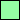
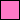
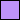

# Spaceman Neon

"Spaceman Neon" is a dark theme specifically designed for terminals.

I have several requirements that an ideal dark theme for terminals would need to satisfy:

**Hard Requirements:**

* Different colors for all 16 ANSI colors. (Often dark themes use the same color for the dark and the bright variant of a color.)
* Dark gray (bright black) must be readable (on the theme's dark background).

**Nice-to-have:**

* Colors match their names (e.g. blue is not reinterpreted as purple)
* All colors are different enough to be easily distinguishable; this is especially challenging with the combination blue/cyan/gray/white where cyan is often similar either to blue or to white/gray.

Spaceman Neon tries to satisfy all of these requirements.

## Color Palette

Name         | Hex       | RGB           | HSL                  | Color
---          | ---       | ---           | ---                  | ---
Black        | `#272936` | `39 41 54`    | `232° 16.1% 18.2%`   | 
Red          | `#ff8080` | `255 128 128` | `0° 100.0% 75.1%`    | 
Dark Red     | `#ff5458` | `255 84 88`   | `359° 100.0% 66.5%`  | 
Green        | `#95ffa4` | `149 255 164` | `128° 100.0% 79.2%`  | 
Dark Green   | `#62d196` | `98 209 150`  | `148° 54.7% 60.2%`   | 
Yellow       | `#ffe999` | `255 233 153` | `47° 100.0% 80.0%`   | 
Dark Yellow  | `#ffb378` | `255 179 120` | `26° 100.0% 73.5%`   | 
Blue         | `#6abeff` | `106 190 255` | `206° 100.0% 70.8%`  | 
Dark Blue    | `#358dea` | `53 141 234`  | `211° 81.2% 56.3%`   | 
Magenta      | `#ff79c6` | `255 121 198` | `326° 100.0% 73.7%`  | 
Dark Magenta | `#bd93f9` | `189 147 249` | `265° 89.5% 77.6%`   | 
Cyan         | `#76e9fd` | `118 233 253` | `189° 97.1% 72.7%`   | 
Dark Cyan    | `#09c5c4` | `9 197 196`   | `180° 91.3% 40.4%`   | 
Gray         | `#c1d0ed` | `193 208 237` | `220° 55.0% 84.3%`   | 
Dark Gray    | `#72719c` | `114 113 156` | `241° 17.8% 52.7%`   | 
White        | `#fefefe` | `254 254 254` | `0° 0.0% 99.6%`      | 

## Credits

Spaceman Neon was mostly inspired by two themes:

* [Challenger Deep](https://github.com/challenger-deep-theme/)
* [Dracula Theme](https://draculatheme.com/)
